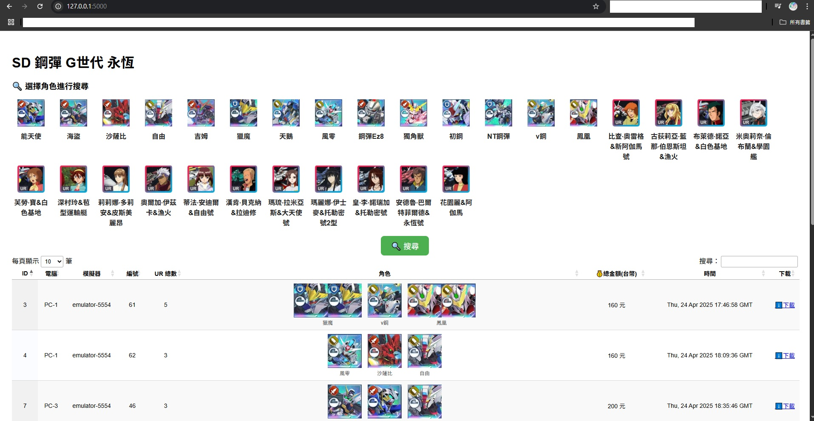
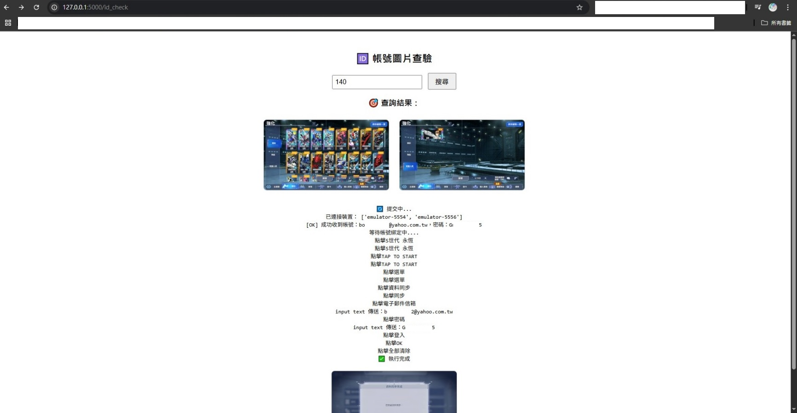

# 模擬器自動化資料提取與全端應用系統

## 專案簡介
本專案整合 Python、ADB、自動化模擬器操作、圖像辨識、資料庫管理、前端展示，實現從遊戲資料提取、篩選到下載的一條龍流程。  
展示了完整的跨領域整合能力、模組化設計與後端前端互動開發技巧。

---

## 技術堆疊
- ADB + Python：控制模擬器，點擊、截圖、自動輸入
- OpenCV：畫面辨識與目標統計
- MariaDB：資料儲存、二進位檔案管理（遊戲備份）
- Flask：後端 API 架設
- HTML + JavaScript + DataTables：前端資料搜尋、篩選、圖片下載
- Server-Sent Events（SSE）：即時顯示指令執行進度
- 帳號驗證與前端綁定帳號、資料安全控管

---

## 系統架構
[模擬器控制] → [截圖辨識] → [資料篩選] → [資料庫寫入] → [後端 API] → [前端展示]


- 模擬器：雷電 LDPlayer9
- 圖片辨識：OpenCV matchTemplate 多目標比對
- 資料儲存：遊戲資料 gamedata.tar 壓縮備份進資料庫
- 資料查詢：支援角色條件篩選與即時圖片下載

---

## 資料夾結構

模擬器自動化專案/ 
├── main.py

├── adb_controller.py 

├── app.py 

├── db_controller.py 

├── image_loader.py 

├── screen_capture.py 

├── simulator.py 

├── write_excel.py

├── images/ # 圖庫比對用

├── templates/ 

│ ├── index.html # 內部版 

│ ├── client.html # 客戶版 

│ ├── id_check.html # 帳號驗證頁 

│ └── images/ # 搜尋用圖片、結果圖片

├── search.py # 查找帳號 

├── final_submit.py # 帳號驗證並輸入模擬器 └── README.md


---

## 快速啟動教學

1. 安裝套件
    ```bash
    pip install flask opencv-python ppadb pillow openpyxl mariadb


2. 啟動資料庫（MariaDB）

    建立 game_db

    建立 game_records / ur_counts 資料表

3. 啟動伺服器

    python app.py

4. 本機存取：

    http://localhost:5000/ ➔ 內部版 (密碼保護)

    http://localhost:5000/client ➔ 客戶版 (無密碼)

    http://localhost:5000/id_check ➔ 帳號查驗

5. 若公開到外網

    使用 ngrok http 5000

##  畫面預覽

###  主頁面（篩選與搜尋）


###  圖片查驗頁（帳號查核）


作者心得

本專案重點在於：

建構模組化的自動化控制

打通資料從設備到前端展示的完整流程

加強跨領域實作（後端 + 前端）

學習與 AI 助手高效協作快速完成專案


